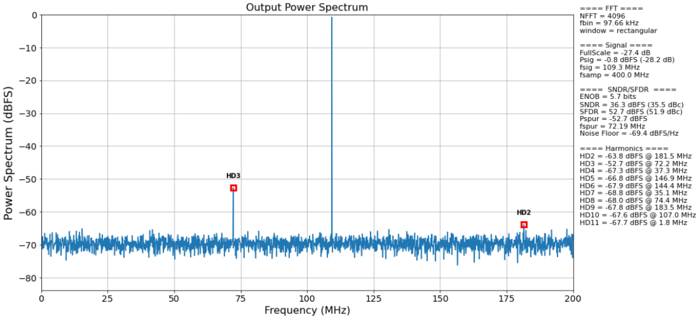

python-adc-eval |Lint| |PyPi Version| |Codestyle|
===================================================

A python-based ADC evaluation tool, suitable for standalone or library-based usage

Details
--------

Package based on
`esynr3z/adc-eval <https://github.com/esynr3z/adc-eval>`__

Tiny tools collection (Python
`NumPy <https://numpy.org/>`__\ +\ `Matplotlib <https://matplotlib.org/>`__
based) to do spectral analysis and calculate the key performance
parameters of an ADC. Just collect some data from the ADC, specify basic
ADC parameters and run analysis. See `example.ipynb <example.ipynb>`__
(you will need `Jupyter Notebook <https://jupyter.org/>`__ to be
installed).

   analyser

References: - `Analog Devices MT-003 TUTORIAL “Understand SINAD, ENOB,
SNR, THD, THD + N, and SFDR so You Don’t Get Lost in the Noise
Floor” <https://www.analog.com/media/en/training-seminars/tutorials/MT-003.pdf>`__
- `National Instruments Application Note 041 “The Fundamentals of
FFT-Based Signal Analysis and
Measurement” <http://www.sjsu.edu/people/burford.furman/docs/me120/FFT_tutorial_NI.pdf>`__

Inspired by Linear Technology (now Analog Devices)
`PScope <https://www.analog.com/en/technical-articles/pscope-basics.html>`__
tool.

USAGE
=======

To load the library in a module:

.. code-block:: python

    import adc_eval

Given an array of values representing the output of an ADC, the spectrum can be analyzed with the following:

.. code-block:: python

    import adc_eval

    adc_eval.spectrum.analyze(<adc list>, <adc_bits>, <adc vref>, <adc fsamp>, window='hanning', no_plot=<True/False>)

|pscope| Image source: `Creating an ADC Using FPGA Resources WP -
Lattice <https://www.latticesemi.com/-/media/LatticeSemi/Documents/WhitePapers/AG/CreatingAnADCUsingFPGAResources.ashx?document_id=36525>`__

.. |pscope| image:: pscope.png
.. |Lint| image:: https://github.com/fronzbot/python-adc-eval/workflows/Lint/badge.svg
   :target: https://github.com/fronzbot/python-adc-eval/actions?query=workflow%3ALint
.. |PyPi Version| image:: https://img.shields.io/pypi/v/spithon.svg
   :target: https://pypi.org/project/python-adc-eval
.. |Codestyle| image:: https://img.shields.io/badge/code%20style-black-000000.svg
   :target: https://github.com/psf/black
